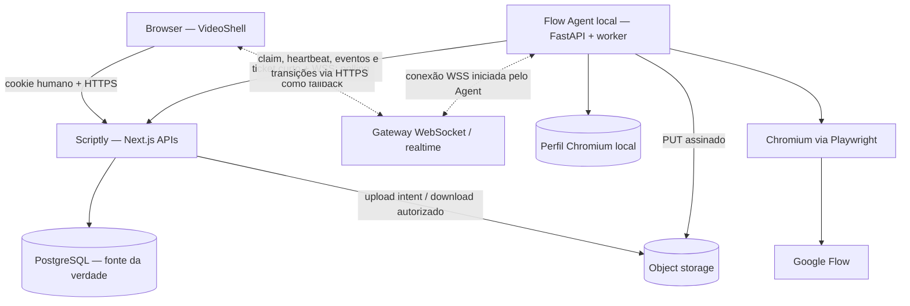
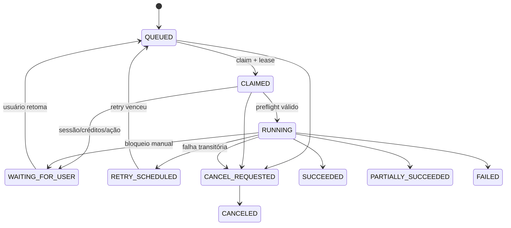

# Arquitetura do Flow Agent para o Scriptly

> Status: proposta para revisão; nenhuma implementação foi realizada.
>
> Auditoria baseada no commit `ee458a0` da branch `main`, em 10 de agosto de 2026.

## 1. Objetivo e limites

O objetivo é acrescentar ao pipeline atual do Scriptly a geração automática de imagens e vídeos no Google Flow, preservando o Scriptly como aplicação principal em Next.js, React, Prisma e PostgreSQL. O Python não substitui nenhuma responsabilidade de produto do Scriptly. Ele é um worker local especializado em automação de navegador.

Pipeline alvo:

```text
Roteiro
→ Narração
→ Sincronização
→ Prompts de cena
→ Geração das cenas no Google Flow
```

Este documento é uma especificação arquitetural e um plano. Não inclui código, alteração no schema, instalação de dependências nem mudança de comportamento.

### 1.1 Premissas adotadas

1. O Scriptly pode estar hospedado fora da máquina do Agent; por isso, o Agent deve iniciar conexões de saída para o Scriptly. Um servidor remoto não deve tentar alcançar diretamente `localhost` do usuário.
2. Cada Flow Agent local opera, no MVP, uma única sessão Google Flow e processa um job por vez.
3. A autenticação no Google será manual em um Chromium visível e com perfil persistente. O Scriptly e o Agent não armazenarão usuário, senha, cookie ou token Google no PostgreSQL.
4. O PostgreSQL do Scriptly será a fonte da verdade para jobs, progresso, tentativas e metadados dos arquivos. O disco local do Agent será apenas cache, spool e perfil do navegador.
5. Os arquivos finais deverão ir para storage de objetos controlado pelo Scriptly. Caminhos locais do Agent não são persistência principal nem URL de entrega.
6. `promptsCena` continuará compatível com o comportamento atual. Ao criar um job, seus prompts serão analisados, validados e copiados para itens imutáveis do job.
7. O contrato novo será aditivo. APIs, tipos e pipeline atuais não serão quebrados.
8. A automação usará somente a interface visível do Google Flow por Playwright. Não dependerá de endpoints internos ou não documentados do produto.
9. Automação de UI, uso comercial e consumo automatizado de créditos deverão ser validados pelo responsável pelo produto contra os termos vigentes do Google antes do rollout.

### 1.2 Critérios de sucesso da futura implementação

- Um usuário autenticado só cria, acompanha, cancela, repete e baixa gerações dos próprios vídeos.
- Um job continua existindo e recuperável após fechar a aba, reiniciar o Next.js, reiniciar o Agent ou perder temporariamente o WebSocket.
- Nenhum retry duplica silenciosamente um output já baixado; quando não for possível provar a deduplicação antes de gastar novos créditos, o job pede intervenção.
- O Scriptly exibe progresso por cena e por job sem depender do estado React que iniciou a operação.
- Outputs finais possuem tipo, tamanho, checksum e associação com `Video`, job e cena.
- Tokens do Agent, cookies Google, headers de autenticação, prompts completos e imagens potencialmente sensíveis não aparecem em logs comuns.
- O pipeline existente continua funcional mesmo que nenhum Flow Agent esteja instalado ou online.

## 2. Resultado da auditoria do estado atual

### 2.1 Stack e configuração

- Next.js `15.5.20`, App Router, React `19.1.2` e TypeScript estrito.
- Prisma `6.19.3` sobre PostgreSQL/Neon, com `DATABASE_URL` pooled e `DIRECT_URL` para operações diretas.
- Tailwind CSS 4 e componentes Radix/shadcn.
- Validação predominantemente com Zod nas rotas novas de CRUD.
- Rotas de API executam no runtime Node quando isso é declarado; não há worker ou fila externa hoje.
- A Content Security Policy permite `connect-src 'self' https: blob:`. Uma origem WebSocket externa exigirá ajuste explícito futuro em `connect-src`.
- O repositório usa `npm run dev`, `npm test`, `npm run lint` e `npm run build`. O `postinstall` executa `prisma generate`; a prática atual de banco é `prisma db push`.
- Não há pasta de migrations Prisma versionadas no repositório.

### 2.2 Modelo de domínio atual

O encadeamento de posse é:

```text
User 1 ── N Channel 1 ── N Video
User 1 ── N Prompt
User 1 ── N ApiCredential
```

`Video` guarda os artefatos como campos do próprio registro:

- `roteiro`, `voz`, `segmentos`, `timings`, `srt`;
- `promptsCena` como um único texto, não como cenas normalizadas;
- `promptSistema`, `provider`, `tema`, `scheduledAt` e `notas`;
- nenhum status persistido, asset binário ou histórico de execução.

O áudio da narração é intencionalmente efêmero. Apenas a voz escolhida e artefatos textuais são persistidos. A geração visual muda a necessidade de armazenamento: vídeos e imagens finais precisam sobreviver ao processo local e estar disponíveis para a UI.

### 2.3 Pipeline atual

`src/lib/videos/pipeline.ts` é um orquestrador client-side. Ele executa no navegador e persiste após cada etapa:

1. reutiliza ou gera `roteiro`;
2. solicita TTS à Darkvi, aguarda por polling e mantém o MP3 em memória;
3. usa `AudioContext` e Whisper no navegador para produzir `segmentos`, `timings` e `srt`;
4. chama o agente de prompts em três passos e salva `promptsCena`;
5. publica progresso apenas em estado React por callback.

Consequências relevantes:

- fechar a aba interrompe a execução atual;
- não há retomada, lease, heartbeat ou retry persistido;
- `?auto=1` dispara o pipeline após a página carregar;
- `VideoShell` remonta seções ao fim para refletir patches;
- o aviso “não feche esta aba” é correto para sincronização atual, mas não deve valer para a futura geração no Flow;
- a nova etapa deve enfileirar um job e retornar rapidamente, sem manter uma request ou callback React aberto por toda a geração.

### 2.4 Estágio e UI do vídeo

`estagioDoVideo` infere quatro estágios pela presença de artefatos: `ideia`, `roteiro`, `narracao` e `sincronizado`. Mesmo que `promptsCena` exista, o progresso fica em 100% quando há sincronização. Portanto:

- não se deve transformar `GenerationJob.status` em um campo genérico de `Video`;
- o estágio editorial atual pode continuar derivado;
- a UI deverá acrescentar um painel independente “Geração das cenas”, com estado do último job e contagem de outputs;
- futuramente, se o produto quiser um estágio consolidado, ele deve ser derivado dos artefatos e do último job bem-sucedido, não duplicado manualmente em `Video.status`.

### 2.5 Prompts de vídeo

O agente de prompts trabalha nas etapas `analise`, `referencias`, `cenas` e `gestao`. O resultado final esperado contém blocos numerados e timestamps, mas o contrato persistido é apenas texto. Há ainda:

- histórico de chat somente no estado do componente;
- limite grande de texto na API;
- geração em múltiplas chamadas quando o provider interrompe por limite;
- provider fake para testes unitários;
- outputs de modelo tratados como texto, sem parser estrutural na fronteira do `Video`.

Antes de criar um job, o Scriptly deve executar um parser versionado e determinístico sobre `promptsCena`. Cada cena válida vira um `GenerationScene` com ordinal, prompt, timestamp e hash. O job congela esse snapshot. Edições posteriores em `Video.promptsCena` não alteram um job já criado.

### 2.6 APIs e autorização

Os padrões que devem ser reutilizados são:

- `getCurrentUser()` nas rotas protegidas;
- escopo por ownership, por exemplo `where: { id, channel: { userId } }`;
- `updateMany`/`deleteMany` com ownership para evitar IDOR;
- DTOs explícitos que convertem `Date` em milissegundos;
- Zod ou validação equivalente na borda;
- clientes browser em `src/lib/.../client.ts`.

Há formatos de erro diferentes entre as APIs atuais: algumas retornam `{ error }`, outras `{ ok, error, code, message }` e o chat retorna `{ ok, message }`. O módulo novo deve adotar um envelope consistente sem modificar respostas legadas:

```json
{
  "error": {
    "code": "GENERATION_JOB_NOT_FOUND",
    "message": "Job de geração não encontrado.",
    "retryable": false,
    "details": null
  }
}
```

### 2.7 Autenticação atual

- Sessões humanas são tokens HMAC-SHA256 em cookie `httpOnly`, `sameSite=strict`, `secure` em produção e validade de oito horas.
- O middleware bloqueia páginas e APIs não públicas.
- `getCurrentUser()` relê `role` e `status` do banco e só aceita usuário `APPROVED`.
- As consultas de canais, vídeos, prompts e credenciais são escopadas pelo usuário.
- Senhas usam scrypt; chaves de providers usam AES-256-GCM por usuário.

Esse mecanismo deve continuar intacto para pessoas. O Agent terá autenticação de máquina separada; nunca receberá o cookie humano nem `AUTH_SESSION_SECRET`.

### 2.8 Testes atuais

O projeto usa `node:test` e `node:assert/strict`, com testes `*.test.ts` ao lado dos módulos. Existem testes unitários para autenticação, criptografia, providers de roteiro, sincronização, seleção de voz e agente de prompts. O `package.json` lista os arquivos explicitamente.

Lacunas relevantes para o módulo futuro:

- não há testes de rotas com banco de teste;
- não há testes de componentes React;
- não há suíte E2E do produto;
- não há teste de concorrência/lease;
- não há contract tests entre TypeScript e Python;
- não há fixture de uma página Flow controlada para testar seletores sem consumir créditos.

Como `node_modules` não estava presente e esta tarefa proíbe instalar dependências, nenhuma suíte foi executada durante esta auditoria.

## 3. Arquitetura proposta

### 3.1 Visão lógica



O diagrama original `Next.js → Python` continua verdadeiro no plano lógico: o Scriptly decide o trabalho e envia comandos pelo canal já aberto. Na rede, porém, o Agent local inicia a conexão para fora. Isso funciona atrás de NAT/firewall e evita expor FastAPI à internet.

### 3.2 Plano de controle e plano de dados

Separar os dois reduz acoplamento:

- **Plano de controle:** pequenos JSONs para criar, reivindicar, atualizar e observar jobs. Usa Next.js, PostgreSQL e opcionalmente WebSocket.
- **Plano de dados:** uploads/downloads de imagens, vídeos, screenshots e bundles de diagnóstico. Usa URLs assinadas diretamente entre Agent/browser e object storage.

Arquivos grandes não devem atravessar uma Route Handler do Next.js salvo em modo de desenvolvimento. Isso evita timeouts, limites de payload, consumo de memória e custo de transferência duplicado.

### 3.3 Fonte da verdade

- PostgreSQL: estado canônico do job, cenas, tentativas, eventos, assets e Agent registrado.
- Object storage: bytes finais e diagnósticos retidos.
- Disco local do Agent: perfil Chromium, arquivo `.part`, cache e manifesto de recuperação.
- WebSocket: transporte efêmero de notificação; nunca estado canônico.
- Google Flow: origem externa da geração, mas não única cópia do output concluído.

## 4. Responsabilidades do Next.js

O Scriptly permanece responsável por:

1. autenticar o usuário e autorizar ownership do canal/vídeo/job/asset;
2. validar que `Video` tem `promptsCena` utilizáveis;
3. converter o texto atual em cenas estruturadas e congelar o snapshot do job;
4. criar o job de forma idempotente e definir prioridade/configuração;
5. escolher um Agent compatível pertencente ao usuário, ou deixar o job aguardando Agent;
6. aplicar a máquina de estados e rejeitar transições inválidas;
7. controlar leases, heartbeats, cancelamento, retry e recuperação;
8. persistir eventos antes de publicá-los em realtime;
9. emitir URLs assinadas de upload com tipo, tamanho e chave pré-determinados;
10. validar a confirmação do upload e associar assets ao `Video`;
11. entregar DTOs e downloads autorizados à UI;
12. calcular progresso agregado e resultado parcial;
13. manter logs de auditoria sem segredos;
14. limpar objetos órfãos e respeitar política de retenção;
15. continuar operando toda a experiência atual quando o Agent estiver offline.

O Next.js não deve:

- controlar Playwright;
- armazenar a sessão Google;
- receber senha Google;
- selecionar elementos da UI do Flow;
- fazer streaming de arquivos grandes através do processo web;
- considerar uma mensagem WebSocket suficiente para confirmar persistência.

## 5. Responsabilidades do Python

O Flow Agent local será responsável por:

1. parear e autenticar a instalação com o Scriptly;
2. manter uma conexão de saída HTTP/WSS e informar capabilities/versão;
3. manter um perfil persistente e isolado do Chromium;
4. permitir login manual no Google Flow e detectar sessão expirada;
5. reivindicar um job com lease e renovar heartbeat;
6. processar as cenas sequencialmente no MVP;
7. abrir ou localizar o projeto Flow correspondente ao job;
8. enviar somente o prompt e opções definidos no contrato;
9. detectar confirmação de créditos, fila, sucesso, bloqueio, falta de créditos, política, sessão expirada e mudança inesperada da UI;
10. aguardar sem busy loop e respeitar timeouts/cancelamento;
11. baixar para arquivo temporário, validar e calcular checksum;
12. solicitar upload intent e enviar o arquivo diretamente ao storage;
13. publicar progresso, transições, tentativas, erros normalizados e diagnósticos;
14. remover temporários somente após confirmação durável do Scriptly;
15. recuperar trabalho após reinício usando o estado do servidor e manifesto local.

O Python não deve:

- gerenciar usuários, canais, vídeos, roteiros, narração ou prompts principais;
- conectar diretamente ao PostgreSQL;
- decidir ownership;
- alterar `Video.promptsCena`;
- guardar a única cópia de um output;
- executar texto do prompt como shell, código, seletor ou caminho de arquivo;
- contornar CAPTCHA, bloqueio de conta, política, confirmação de pagamento ou proteção anti-bot.

## 6. Comunicação Next.js ↔ Python

### 6.1 Topologia recomendada

O padrão primário é **pull com conexão de saída**:

1. Agent autentica no Scriptly.
2. Agent abre WSS, se disponível, para receber a notificação `job.available`.
3. Agent chama por HTTPS o endpoint de claim; o WebSocket não entrega o payload completo nem concede o job.
4. Se WSS cair, o Agent usa long-poll/claim com backoff.
5. Eventos e transições voltam por HTTPS idempotente.
6. O Scriptly publica o evento persistido para a UI.

Esse desenho evita depender de CORS, certificados locais e mixed content entre uma página HTTPS e `http://127.0.0.1`.

### 6.2 Contrato e versionamento

- Namespace de máquina: `/api/flow-agent/v1/...`.
- Campos JSON em `camelCase`; enums em `UPPER_SNAKE_CASE`; timestamps em ISO 8601 UTC.
- IDs opacos (`cuid`/UUID) e nunca ordinais previsíveis como autorização.
- Toda mutação do Agent leva `requestId` único; o servidor persiste/deduplica.
- Transições levam `expectedVersion` para optimistic concurrency.
- O Agent anuncia `protocolVersion`, `agentVersion` e capabilities.
- O servidor recusa versão incompatível com erro explícito e não entrega jobs.

### 6.3 Envelope de evento

```json
{
  "eventId": "evt_agent_uuid",
  "jobId": "job_id",
  "sceneId": "scene_id",
  "type": "SCENE_PHASE_CHANGED",
  "occurredAt": "2026-08-10T13:00:00.000Z",
  "payload": {
    "phase": "WAITING_GENERATION",
    "progress": 45,
    "message": "Aguardando o Google Flow"
  }
}
```

O servidor atribui `sequence` monotônico por job ao persistir. Repetir o mesmo `eventId` retorna sucesso idempotente sem criar evento duplicado.

## 7. Fluxo de criação de jobs

1. O usuário conclui ou revisa `promptsCena` e escolhe gerar imagem ou vídeo, modelo/opções permitidas e Agent.
2. `POST /api/videos/:videoId/generation-jobs` autentica o usuário e confirma ownership por `Video → Channel → User`.
3. A rota valida limites de payload, presença de sincronização e prompts, tipo de mídia, quantidade máxima e opções allowlisted.
4. O parser versionado transforma `promptsCena` em cenas. Falha estrutural devolve `422 PROMPTS_SCENE_PARSE_ERROR` com números/timestamps problemáticos, sem criar job parcial.
5. A rota calcula `sourceHash` do texto original e `promptHash` de cada cena.
6. Em uma transação, cria `GenerationJob`, `GenerationScene[]` e primeiro `GenerationEvent`.
7. O header `Idempotency-Key` impede duplo clique ou retry de rede de criar dois jobs equivalentes.
8. O job começa `QUEUED`. Se não houver Agent elegível online, continua na fila e a UI mostra “Aguardando Agent local”.
9. O servidor notifica Agents elegíveis via realtime; long-poll continua como fallback.
10. Um Agent faz claim atômico. O servidor associa `agentId`, incrementa `version`, define lease e muda para `CLAIMED`.

Não se deve anexar a geração à request que terminou os prompts. O pipeline atual apenas cria o job ao final e passa a observar seu ID.

## 8. Fluxo de atualização de status

1. Agent envia heartbeat enquanto detém o lease.
2. Antes de cada ação relevante, envia uma transição com `expectedVersion`.
3. Progresso frequente pode ser agregado em lotes para evitar escrita excessiva; mudanças de fase e erros nunca são descartados.
4. Next valida ownership do Agent, lease ativo e transição permitida.
5. Na mesma transação, atualiza o estado e grava `GenerationEvent`.
6. Só depois do commit publica o evento no canal realtime.
7. A UI atualiza otimisticamente a partir do evento, mas reconsulta `GET /api/generation-jobs/:id` ao reconectar.
8. Progresso do job é derivado das cenas, com peso por fase, e nunca aceito cegamente como “100%” do Agent.

Eventos essenciais:

- `JOB_CREATED`, `JOB_CLAIMED`, `JOB_STARTED`;
- `SCENE_STARTED`, `SCENE_PHASE_CHANGED`, `SCENE_PROGRESS`;
- `ATTEMPT_FAILED`, `RETRY_SCHEDULED`;
- `SESSION_REQUIRED`, `CREDITS_REQUIRED`, `USER_ACTION_REQUIRED`;
- `ASSET_UPLOAD_STARTED`, `ASSET_AVAILABLE`;
- `SCENE_SUCCEEDED`, `SCENE_FAILED`, `SCENE_CANCELED`;
- `JOB_CANCEL_REQUESTED`, `JOB_SUCCEEDED`, `JOB_PARTIALLY_SUCCEEDED`, `JOB_FAILED`, `JOB_CANCELED`;
- `LEASE_EXPIRED`, `JOB_RECOVERED`.

## 9. Estratégia de WebSocket

### 9.1 Princípios

- WebSocket melhora latência, não confiabilidade.
- Todo evento importante existe no PostgreSQL antes de ser transmitido.
- Cliente e Agent reconectam com backoff exponencial e jitter.
- A reconexão informa o último `sequence`; o servidor envia o que faltou ou ordena uma ressincronização HTTP.
- Heartbeats WebSocket não substituem o lease persistido do job.

### 9.2 Limitação de deployment

Route Handlers do Next.js não devem ser presumidos como servidor WebSocket durável em ambiente serverless. A escolha futura depende do deployment:

- **Next.js self-hosted em processo persistente:** gateway WS dedicado ao lado do Next.js, compartilhando autenticação/event bus.
- **Deployment serverless:** serviço realtime gerenciado ou gateway persistente separado.
- **MVP sem nova infraestrutura:** polling da UI e long-poll do Agent; o contrato de eventos já nasce compatível com WS.

Não é recomendável conectar o browser diretamente ao FastAPI local. Além de CORS/mixed content/certificados, isso exporia detalhes do Agent e tornaria a UI dependente da máquina permanecer acessível.

### 9.3 Canais

- `user:{userId}`: resumo de jobs e disponibilidade do Agent para a UI.
- `job:{jobId}`: eventos detalhados, autorizado por ownership.
- `agent:{agentId}`: notificações de job disponível, cancelamento e rotação de configuração.

Tokens de conexão devem ser curtos, emitidos via HTTPS e conter apenas canais autorizados. Não enviar bearer token em query string persistida em logs.

## 10. Estratégia de downloads e storage

### 10.1 Download no Flow

1. Antes de submeter, o Agent registra o estado visual e a lista conhecida de assets do projeto.
2. Após sucesso, identifica o novo asset por contexto do job/cena e metadados, não apenas por posição “último card”.
3. Usa o evento de download do Playwright e grava em nome gerado pelo Agent, nunca em nome controlado pelo prompt.
4. O arquivo nasce como `.part` dentro de um diretório validado do job.
5. Ao terminar, valida magic bytes, MIME allowlisted, tamanho mínimo/máximo e, para vídeo, metadados básicos/duração.
6. Calcula SHA-256 e renomeia atomicamente para o nome interno final.

O Flow oficialmente permite baixar vídeos/arquivos gerados e mantém a mídia no projeto aberto. Isso ajuda na reconciliação, mas a UI e os nomes podem mudar; o Agent deve falhar de forma diagnosticável se não puder provar qual asset pertence à cena.

### 10.2 Upload ao Scriptly

1. Agent solicita um upload intent informando tipo, tamanho e checksum.
2. Next cria `GenerationAsset` em `PENDING_UPLOAD` e devolve URL PUT assinada de curta validade, método, headers obrigatórios e `assetId`.
3. Agent envia diretamente ao object storage.
4. Agent chama completion; Next verifica existência, tamanho, checksum e tipo no storage.
5. Em transação, marca o asset `AVAILABLE`, associa à cena/vídeo e grava evento.
6. Só então o Agent apaga o temporário local.

### 10.3 Download pelo usuário

`GET /api/generation-assets/:assetId/download` autentica o usuário, confirma ownership pelo vídeo e devolve um redirect/URL GET assinada curta. A chave interna do storage não é exposta como autorização permanente.

### 10.4 Retenção

- Outputs finais: conforme política do produto; não apagar automaticamente sem decisão explícita.
- Screenshots de falha: retenção curta configurável, por exemplo 7–30 dias.
- Logs compactados: retenção curta e redigida.
- Temporários locais: limpeza após confirmação ou por garbage collector de jobs encerrados.
- Exclusão de `Video`: transação marca assets para garbage collection; apagar objeto fora da transação com retry idempotente.

## 11. Integração com `Video`

`Video` continua sendo o agregado editorial principal. A integração recomendada é por relações, sem adicionar dezenas de campos de execução ao modelo:

```text
Video
 ├── generationJobs[]
 │    └── scenes[]
 │         ├── attempts[]
 │         └── assets[]
 └── generationAssets[]
```

Regras:

- `Video.promptsCena` permanece o rascunho editável atual.
- `GenerationScene.prompt` é o snapshot usado naquela execução.
- Uma nova geração cria novo job; não sobrescreve histórico.
- O painel do vídeo mostra o job ativo e o último job terminal.
- “Regenerar cena” cria uma nova tentativa/cena de retry de forma auditável; não substitui bytes silenciosamente.
- `VideoSalvo` pode receber futuramente resumos opcionais e aditivos, como `generationSummary`, ou a UI pode buscar em endpoint separado. Preferência: endpoint separado para não aumentar todas as listagens de vídeo.
- `estagioDoVideo` não deve consultar banco nem absorver a máquina de estados do job. Um novo helper apresentacional combina estágio editorial e resumo de geração.
- Ao excluir o vídeo, jobs/cenas/metadados podem usar cascade; objetos no storage entram em coleta assíncrona.

## 12. Novos models Prisma necessários

Os nomes e campos abaixo são proposta de contrato, não alteração aplicada.

### 12.1 `FlowAgent`

Representa uma instalação pareada, não um processo efêmero.

Campos principais:

- `id`, `userId`, relação com `User`;
- `name`, `protocolVersion`, `agentVersion`, `capabilities Json`;
- `credentialHash` ou identificador de credencial rotacionável; nunca o segredo em claro;
- `lastSeenAt`, `lastSessionCheckAt`, `revokedAt`;
- `createdAt`, `updatedAt`;
- jobs associados.

Índices: `userId`, `lastSeenAt`; nome único apenas dentro do usuário, se desejado.

### 12.2 `GenerationJob`

Campos principais:

- `id`, `videoId`, `userId`, `agentId?`;
- `mediaType` (`IMAGE` ou `VIDEO`) e `status`;
- `currentPhase?`, `configuration Json`, `parserVersion`;
- `sourceHash`, `idempotencyKey` e `version`;
- contadores derivados/cacheados: `totalScenes`, `succeededScenes`, `failedScenes`;
- `leaseExpiresAt?`, `lastHeartbeatAt?`;
- `cancelRequestedAt?`, `nextRetryAt?`;
- `errorCode?`, `errorMessage?` redigida;
- `queuedAt`, `startedAt?`, `completedAt?`, `createdAt`, `updatedAt`.

Constraints importantes:

- unique `(userId, idempotencyKey)`;
- índices `(status, queuedAt)`, `(agentId, status)` e `(videoId, createdAt)`;
- `userId` é denormalizado para consultas/autorização eficientes, mas só é preenchido a partir do canal no servidor.

### 12.3 `GenerationScene`

Unidade de trabalho idempotente e retomável.

Campos principais:

- `id`, `jobId`, `ordinal`, `sourcePromptNumber?`;
- `startMs?`, `endMs?`, `prompt`, `promptHash`;
- `status`, `currentPhase?`, `progress`;
- `attemptCount`, `maxAttempts`, `nextRetryAt?`;
- `externalProjectRef?`, `externalAssetRef?` como dicas, nunca como autorização;
- `errorCode?`, `errorMessage?`;
- `startedAt?`, `completedAt?`, `createdAt`, `updatedAt`.

Constraint unique `(jobId, ordinal)` e índice `(jobId, status)`.

### 12.4 `GenerationAttempt`

Preserva histórico de retry e permite explicar custo/falha.

Campos principais:

- `id`, `sceneId`, `agentId`, `number`;
- `status`, `startedAt`, `endedAt?`, `nextRetryAt?`;
- `errorClass?`, `errorCode?`, `errorMessage?`;
- `diagnostics Json?`, somente dados redigidos.

Constraint unique `(sceneId, number)`.

### 12.5 `GenerationAsset`

Metadados dos bytes; outputs e diagnósticos podem compartilhar o modelo com políticas distintas.

Campos principais:

- `id`, `videoId`, `jobId`, `sceneId?`, `attemptId?`;
- `kind` (`OUTPUT_IMAGE`, `OUTPUT_VIDEO`, `DIAGNOSTIC_SCREENSHOT`, `DIAGNOSTIC_LOG`);
- `status` (`PENDING_UPLOAD`, `AVAILABLE`, `QUARANTINED`, `DELETED`);
- `storageProvider`, `storageKey`, `originalFilename?`;
- `mimeType`, `sizeBytes`, `sha256`;
- `width?`, `height?`, `durationMs?`;
- `isDiagnostic`, `retentionUntil?`, `createdAt`, `updatedAt`.

Índices por `videoId`, `jobId`, `sceneId`; `storageKey` unique.

### 12.6 `GenerationEvent`

Outbox/audit trail e replay do realtime.

Campos principais:

- `id`, `jobId`, `sequence`, `agentEventId?`;
- `actorType` (`USER`, `SERVER`, `AGENT`), `actorId?`;
- `type`, `payload Json`, `createdAt`.

Constraints unique `(jobId, sequence)` e unique condicional/lógica para `agentEventId`. O payload deve ser limitado e redigido; prompts completos não devem ser repetidos em cada evento.

### 12.7 Dados efêmeros de pairing

Um código de pareamento exige registro com hash, `userId`, expiração e `usedAt`. Pode ser uma tabela `FlowAgentPairing` ou um store efêmero durável. Para um primeiro release com PostgreSQL como única infraestrutura, a tabela é a opção mais simples e auditável; a linha deve expirar em poucos minutos e ser apagada após uso.

## 13. Estados de `GenerationJob`

O status representa ciclo de vida; a fase representa atividade operacional. Separá-los evita enum de status excessivamente acoplado à UI do Flow.

### 13.1 Status do job

| Status | Significado | Terminal |
| --- | --- | --- |
| `QUEUED` | Persistido e disponível para um Agent elegível | Não |
| `CLAIMED` | Agent possui lease, ainda preparando execução | Não |
| `RUNNING` | Pelo menos uma cena está em execução | Não |
| `WAITING_FOR_USER` | Requer login, confirmação legítima, créditos ou decisão humana | Não |
| `RETRY_SCHEDULED` | Nenhuma execução agora; retry futuro já calculado | Não |
| `CANCEL_REQUESTED` | Cancelamento persistido; Agent deve parar em ponto seguro | Não |
| `SUCCEEDED` | Todas as cenas requeridas possuem output disponível | Sim |
| `PARTIALLY_SUCCEEDED` | Há outputs disponíveis e cenas definitivamente falhas/canceladas | Sim |
| `FAILED` | Nenhuma conclusão aceitável ou falha fatal do job | Sim |
| `CANCELED` | Cancelamento confirmado; outputs já concluídos permanecem auditáveis | Sim |

`WAITING_FOR_USER` não deve manter lease indefinidamente. O Agent libera recursos e o job guarda `requiredAction` tipado. Depois da ação, o usuário cria uma retomada/transição autorizada.

### 13.2 Fases operacionais

- `VALIDATING_SESSION`;
- `OPENING_PROJECT`;
- `PREPARING_PROMPT`;
- `SUBMITTING_PROMPT`;
- `WAITING_GENERATION`;
- `IDENTIFYING_ASSET`;
- `DOWNLOADING`;
- `VALIDATING_FILE`;
- `UPLOADING`;
- `FINALIZING`.

### 13.3 Status da cena

- `PENDING`, `RUNNING`, `RETRY_SCHEDULED`, `WAITING_FOR_USER`;
- `SUCCEEDED`, `FAILED`, `CANCELED`, `SKIPPED`.

### 13.4 Transições essenciais



Toda transição não listada é rejeitada com conflito `409 INVALID_JOB_TRANSITION`.

## 14. Endpoints Next.js necessários

### 14.1 APIs para usuário/UI

| Método e rota | Finalidade |
| --- | --- |
| `POST /api/videos/:videoId/generation-jobs` | Validar prompts, congelar cenas e criar job idempotente |
| `GET /api/videos/:videoId/generation-jobs` | Listar histórico paginado/resumido do vídeo |
| `GET /api/generation-jobs/:jobId` | Obter job, cenas, progresso e assets autorizados |
| `GET /api/generation-jobs/:jobId/events?afterSequence=N` | Reconciliar/reproduzir eventos paginados |
| `POST /api/generation-jobs/:jobId/cancellations` | Criar solicitação idempotente de cancelamento |
| `POST /api/generation-jobs/:jobId/retries` | Criar retry explícito das cenas elegíveis |
| `GET /api/generation-assets/:assetId/download` | Autorizar e emitir download assinado |
| `GET /api/flow-agents` | Listar Agents pareados, versão, sessão e presença |
| `POST /api/flow-agent-pairings` | Emitir código de pareamento curto para o usuário atual |
| `DELETE /api/flow-agents/:agentId` | Revogar instalação do próprio usuário |
| `POST /api/realtime-tickets` | Emitir ticket curto para canais WS autorizados |

Criação de job deve aceitar, no máximo:

```json
{
  "mediaType": "VIDEO",
  "agentId": "optional_agent_id",
  "sceneOrdinals": [1, 2, 3],
  "options": {
    "aspectRatio": "16:9",
    "model": "allowlisted-model",
    "outputsPerScene": 1
  }
}
```

Nunca aceitar URL de upload, caminho local, seletor CSS, comando Playwright ou nome de projeto arbitrário como instrução executável.

### 14.2 APIs para Agent

| Método e rota | Finalidade |
| --- | --- |
| `POST /api/flow-agent/v1/pairings/exchange` | Trocar código único por identidade/credencial da instalação |
| `POST /api/flow-agent/v1/auth/tokens` | Trocar credencial de dispositivo por access token curto |
| `POST /api/flow-agent/v1/jobs/claims` | Long-poll e claim atômico de um job elegível |
| `GET /api/flow-agent/v1/jobs/:jobId` | Reconciliar estado canônico após reconnect/crash |
| `PATCH /api/flow-agent/v1/jobs/:jobId/lease` | Renovar lease/heartbeat com version check |
| `POST /api/flow-agent/v1/jobs/:jobId/transitions` | Solicitar transição validada da máquina de estados |
| `POST /api/flow-agent/v1/jobs/:jobId/events` | Ingerir lote idempotente de progresso/eventos |
| `POST /api/flow-agent/v1/jobs/:jobId/upload-intents` | Reservar asset e obter PUT assinado |
| `POST /api/flow-agent/v1/assets/:assetId/completions` | Confirmar e validar upload no storage |
| `POST /api/flow-agent/v1/jobs/:jobId/releases` | Liberar lease de forma explícita em pausa/shutdown seguro |

Todas as rotas do Agent devem verificar:

- access token válido e `agentId` correspondente;
- Agent não revogado;
- job do mesmo `userId` do Agent;
- lease/version quando a operação exige ownership temporal;
- tamanho máximo e schema exato;
- idempotência por `requestId`/`eventId`;
- rate limit por Agent e usuário.

## 15. Endpoints Python necessários

Em produção, o Next.js não precisa chamar esses endpoints. Eles ficam em loopback para operação local e diagnóstico:

| Método e rota | Finalidade |
| --- | --- |
| `GET /healthz` | Processo vivo; não verifica Google nem rede externa |
| `GET /readyz` | Configuração válida e worker capaz de aceitar trabalho |
| `GET /v1/agent/status` | Pareamento, versão, conectividade, job atual e fila local |
| `GET /v1/session/status` | Estado redigido da sessão Google Flow |
| `POST /v1/session/browser` | Abrir Chromium visível para login/reautenticação manual |
| `POST /v1/worker/pauses` | Pausar novos claims sem matar o job de forma abrupta |
| `DELETE /v1/worker/pauses/current` | Retomar claims |
| `GET /v1/diagnostics/events` | Stream local redigido, opcional |
| `WS /v1/diagnostics/ws` | Atualização local para tray/CLI, opcional |

Regras:

- bind padrão exclusivamente em `127.0.0.1`, porta configurável;
- sem CORS wildcard;
- endpoints mutáveis exigem token administrativo local, mesmo em loopback;
- documentação OpenAPI não exposta fora de desenvolvimento;
- endpoint direto `POST /v1/jobs` somente em harness de desenvolvimento e desabilitado por padrão, para não criar duas fontes de verdade.

## 16. Autenticação entre Scriptly e Agent local

### 16.1 Separação de identidades

- Pessoa: cookie atual do Scriptly, sem mudanças.
- Agent: credencial de dispositivo própria, com escopos de máquina.
- Google: sessão do perfil Chromium local, nunca convertida em credencial do Scriptly.

### 16.2 Pairing recomendado

1. Usuário autenticado solicita um código no Scriptly.
2. O servidor armazena somente o hash, associado ao `userId`, com expiração de 5–10 minutos e uso único.
3. Usuário informa o código no CLI/tray do Agent.
4. Agent envia código, nome, versão e capabilities por HTTPS.
5. Scriptly cria `FlowAgent` e devolve um segredo de dispositivo uma única vez.
6. Agent guarda o segredo no Windows Credential Manager/keyring do SO, não em `.env` texto puro.
7. Servidor armazena hash do segredo.
8. Agent troca o segredo por access token curto, por exemplo 10 minutos, escopado a `jobs:claim`, `jobs:update`, `assets:upload` e ao próprio `agentId/userId`.
9. Rotação ou revogação invalida novos access tokens; tokens curtos expiram naturalmente.

### 16.3 Controles adicionais

- TLS obrigatório; WSS em produção.
- Comparação de segredo em tempo constante.
- Não colocar token em URL/query string.
- Redigir `Authorization`, cookies, signed URLs e pairing code nos logs.
- Limitar tentativas de pairing e token exchange.
- Registrar audit event para parear, rotacionar e revogar.
- Não compartilhar um Agent entre usuários no MVP. Uma sessão Flow costuma representar uma conta/créditos; isolamento por usuário evita cobrança cruzada.
- O Agent nunca recebe `APP_ENCRYPTION_KEY`, `AUTH_SESSION_SECRET`, `DATABASE_URL` ou credenciais de providers do Scriptly.

## 17. Estrutura sugerida para `flow-agent/`

```text
flow-agent/
├── README.md
├── pyproject.toml
├── .env.example
├── src/
│   └── flow_agent/
│       ├── main.py
│       ├── settings.py
│       ├── api/
│       │   ├── app.py
│       │   └── routes/
│       │       ├── health.py
│       │       ├── session.py
│       │       └── diagnostics.py
│       ├── auth/
│       │   ├── pairing.py
│       │   ├── tokens.py
│       │   └── keyring_store.py
│       ├── domain/
│       │   ├── models.py
│       │   ├── states.py
│       │   ├── events.py
│       │   └── errors.py
│       ├── scriptly/
│       │   ├── client.py
│       │   ├── contracts.py
│       │   ├── realtime.py
│       │   └── uploads.py
│       ├── worker/
│       │   ├── runner.py
│       │   ├── lease.py
│       │   ├── retry.py
│       │   ├── cancellation.py
│       │   └── recovery.py
│       ├── flow/
│       │   ├── browser.py
│       │   ├── session.py
│       │   ├── selectors.py
│       │   ├── projects.py
│       │   ├── generation.py
│       │   ├── detectors.py
│       │   └── downloads.py
│       ├── storage/
│       │   ├── spool.py
│       │   ├── validation.py
│       │   └── checksums.py
│       └── observability/
│           ├── logging.py
│           ├── redaction.py
│           └── screenshots.py
├── tests/
│   ├── unit/
│   ├── contract/
│   ├── integration/
│   ├── fixtures/
│   │   └── fake_flow/
│   └── e2e/
└── var/                         # gitignored
    ├── chromium-profile/
    ├── spool/
    ├── manifests/
    ├── logs/
    └── screenshots/
```

Princípios de organização:

- `flow/` conhece Playwright e a UI externa; `worker/` conhece jobs, mas não seletores;
- `scriptly/` é o único cliente do contrato HTTP/WSS;
- `domain/` não importa FastAPI nem Playwright;
- seletores e detectores ficam centralizados, versionados e cobertos por fixtures;
- `var/` nunca entra no Git e recebe permissões restritas ao usuário do SO.

## 18. Estratégia de retry

### 18.1 Classificação de erros

| Classe | Exemplos | Ação padrão |
| --- | --- | --- |
| Transitório de rede | timeout DNS/TLS, conexão interrompida, upload 5xx | retry automático |
| Transitório do Flow | fila/pending recuperável, erro temporário, card ainda não materializado | reconciliar e depois retry |
| Rate limit/capacidade | 429, indisponibilidade temporária | backoff respeitando indicação externa |
| Sessão | login expirado, challenge, CAPTCHA | `WAITING_FOR_USER`, sem contorno automático |
| Crédito/assinatura | saldo insuficiente, confirmação inesperada | `WAITING_FOR_USER`, sem gasto automático adicional |
| Política/conteúdo | bloqueio explícito do prompt | falha não retryable; voltar ao gerenciamento de prompts |
| Contrato | prompt inválido, tipo não suportado | falha não retryable |
| Automação incompatível | seletor essencial ausente/UI mudou | circuit breaker e diagnóstico; não clicar às cegas |
| Arquivo inválido | HTML renomeado, zero bytes, MIME inesperado | uma nova tentativa de download; não regenerar imediatamente |

### 18.2 Política

- Retry é por cena, não por job inteiro.
- Padrão inicial sugerido: no máximo 3 tentativas automáticas por cena.
- Backoff sugerido: 15 s, 60 s, 5 min, com jitter e teto configurável.
- Upload pode ter mais retries que geração, pois não gasta créditos de geração.
- Retry manual cria `GenerationAttempt` novo e registra o usuário que o pediu.
- Um circuit breaker por Agent pausa novos claims após repetidas falhas de seletor/sessão.
- A configuração exata deve ser ambiente/política, não números espalhados no código.

### 18.3 Idempotência e créditos

Browser automation não consegue garantir “exactly once” no Google Flow. Entre clicar em gerar e persistir o resultado, o Agent pode cair. Ao retomar:

1. reabre o projeto;
2. procura output já criado usando referências salvas, janela temporal, prompt hash e estado anterior;
3. se encontrar correspondência inequívoca, baixa sem regenerar;
4. se houver ambiguidade, entra em `WAITING_FOR_USER` em vez de gastar créditos novamente;
5. só gera de novo quando provar que não houve output ou quando o usuário autorizar.

Cada projeto/asset deve receber, quando a UI permitir, um rótulo de correlação não sensível derivado de `jobId/sceneId`. Não incluir prompt completo nem ID de usuário no nome visível.

## 19. Estratégia de timeout

Timeouts devem ser separados e configuráveis:

| Operação | Valor inicial sugerido | Resultado |
| --- | --- | --- |
| Navegação/carregamento da página | 60 s | retry transitório ou diagnóstico de UI |
| Preflight de sessão | 30 s | `WAITING_FOR_USER` se login necessário |
| Submissão do prompt | 90 s | reconciliar antes de repetir |
| Sem mudança observável na geração | 5 min | alerta/diagnóstico, continuar até timeout absoluto |
| Geração de uma cena | 30 min | reconciliar; retry ou intervenção conforme evidência |
| Download | 10 min | retry de download, não de geração |
| Upload | 15 min | renovar intent e repetir upload |
| Heartbeat | a cada 10–15 s | lease continua válido |
| Lease | 45–60 s | expiração recuperável por outro ciclo |
| Job total | derivado do número de cenas, com teto | falha/pausa controlada, nunca request web aberta |

O relógio usado para lease é o do servidor. O Agent envia timestamps para observabilidade, mas não decide expiração canônica. Cancelamento deve ser checado entre fases e durante waits, com intervalo curto.

## 20. Recuperação após crash

### 20.1 Crash do Agent

1. Heartbeat para; lease expira.
2. Scriptly registra `LEASE_EXPIRED` e move job/cena para estado recuperável, sem apagar tentativa.
3. Ao reiniciar, Agent autentica e consulta qualquer job anteriormente associado.
4. Compara manifesto local e estado canônico.
5. Arquivo completo ainda não enviado: recalcula checksum e retoma upload.
6. Geração possivelmente submetida: reconcilia o projeto Flow antes de novo clique.
7. Arquivo `.part` sem confirmação: tenta validar/continuar se seguro ou remove após registrar diagnóstico.

### 20.2 Crash do Next.js/gateway

- Agent mantém pequeno buffer local de eventos com `eventId` e reenvia após reconectar.
- O lease expira apenas no servidor; durante indisponibilidade curta, Agent pode concluir a fase local, mas não inicia nova cena após margem segura sem renovar.
- WebSocket perdido não cancela job.
- Após reconexão, `GET job` + `afterSequence` reconcilia estado.

### 20.3 Falha do PostgreSQL ou storage

- Sem persistência de transição, o Agent não considera a etapa confirmada.
- Upload concluído sem completion cria possível objeto órfão, removido por GC com base em intents expirados.
- Registro `AVAILABLE` sem objeto confirmado é proibido.
- Job terminal só ocorre quando os assets obrigatórios estão `AVAILABLE`.

### 20.4 Shutdown planejado

O Agent para novos claims, conclui ou estaciona a fase segura atual, envia release de lease, persiste o manifesto e fecha Chromium sem apagar o perfil.

## 21. Logs, screenshots e observabilidade

### 21.1 Logs estruturados

JSON local e/ou enviado ao Scriptly com:

- `timestamp`, `level`, `component`, `eventCode`;
- `agentId`, `jobId`, `sceneId`, `attemptId`, `requestId`;
- fase, duração e resultado;
- erro normalizado e `retryable`.

Não registrar:

- bearer tokens, pairing code, cookies ou signed URLs;
- conteúdo completo de prompt por padrão;
- HTML completo da página;
- credenciais, dados da conta Google ou headers de rede;
- screenshots em sucesso rotineiro.

### 21.2 Screenshots e diagnóstico

- Capturar screenshot em falha de seletor, estado inesperado, timeout absoluto e intervenção humana.
- Preferir recorte da região relevante; evitar avatar, e-mail, saldo e outras áreas de conta.
- Nome interno gerado por IDs opacos.
- Se necessário, salvar screenshot completo apenas localmente e exigir opt-in explícito para upload.
- Gerar um bundle com screenshot redigida, DOM/ARIA snapshot limitado, versão do Agent, URL allowlisted sem query e últimos eventos redigidos.
- Retenção curta; downloads de diagnóstico apenas ao dono/admin autorizado.

### 21.3 Métricas futuras

- jobs por status, idade da fila e Agents online;
- duração por fase e tipo de mídia;
- taxa de sucesso por cena/tentativa;
- retries por classe de erro;
- sessão expirada, crédito insuficiente e falha de seletor;
- bytes de upload e assets órfãos;
- diferença entre eventos recebidos e publicados.

## 22. Threat model resumido

### 22.1 Ativos

- sessão Google Flow e créditos da conta;
- outputs, prompts e dados de vídeos dos usuários;
- credencial do Agent;
- signed URLs e arquivos finais;
- disponibilidade do Agent/browser.

### 22.2 Fronteiras e controles

| Fronteira | Risco | Controle principal |
| --- | --- | --- |
| Browser humano → Next | IDOR, CSRF, payload abusivo | cookie atual, ownership, Zod, limites, idempotência |
| Agent → Next | Agent falso, replay, update cruzado | pairing, token curto, `agentId/userId`, request IDs, lease/version |
| Next/Agent → storage | upload arbitrário, objeto trocado | key definida no servidor, URL curta, checksum, MIME/magic bytes, size cap |
| Prompt → automação | prompt injection virar comando/caminho | prompt é apenas texto em campo Flow; nunca shell/seletor/path |
| Chromium → Flow | sessão roubada, UI alterada | perfil local restrito, browser não exposto, locators semânticos, fail closed |
| Diagnóstico → operador | vazamento de conta/prompts | redaction, recorte, retenção e autorização |

O FastAPI não deve expor CDP/remote debugging em `0.0.0.0`. Downloads são salvos somente sob um diretório resolvido/validado do job, sem `..`, symlinks inesperados ou nome vindo do Flow como caminho final.

## 23. Estratégia de testes futura

### 23.1 TypeScript/Next.js

- Unitários com `node:test`: parser de prompts, state machine, cálculo de progresso, retry e DTOs.
- Contract tests: exemplos JSON válidos/inválidos compartilhados com Python.
- Integração com PostgreSQL descartável: ownership, idempotência, claim atômico, lease, optimistic concurrency e cascade.
- Testes de rota: 401/403/404/409/422/429, limites de corpo e usuários cruzados.
- Componentes: painel reconectando, progresso, parcial, cancelamento e Agent offline.

### 23.2 Python

- Unitários: classificação de erros, backoff, manifesto, checksum, validação de arquivo e redaction.
- Contract tests contra schemas/versionamento do Scriptly.
- Integração com página fake local que reproduz estados do Flow: sessão, confirmação, pending, sucesso, política, crédito, download e mudança de seletor.
- E2E real manual/limitado em conta dedicada e orçamento controlado; não usar em toda CI.
- Teste de crash em cada fronteira: após submit, durante espera, após download, durante upload e antes do completion.

### 23.3 Verificação de release

- `npm test`, `npm run lint`, `npm run build`;
- testes Python, lint/type check escolhidos na futura implementação;
- teste de contrato cruzado;
- fluxo feliz com uma imagem e um vídeo;
- Flow bloqueado, sem créditos e sessão expirada;
- dois usuários tentando acessar o mesmo job/asset;
- Agent offline, reconexão, lease expirado e retry sem duplicar geração;
- download validado e autorizado.

## 24. Etapas de implementação

Cada fase deve terminar funcionando e ser aprovada antes da próxima. Nenhuma implementação deve começar sem revisão deste documento e resolução das perguntas abertas.

### Fase 0 — spike de viabilidade e conformidade

Objetivo: reduzir primeiro o maior risco, a automação de uma UI externa.

Aceite:

- termos/políticas revistos pelo responsável;
- conta Flow de teste e orçamento definidos;
- login manual persistente comprovado;
- geração e download de uma imagem e um vídeo identificados sem endpoint interno;
- estados de política, crédito e pending documentados;
- nenhum CAPTCHA/controle é contornado.

Verificação: execução manual registrada, sem integração ao Scriptly e sem código de produção.

### Fase 1 — contrato e domínio no Scriptly

Objetivo: definir parser, DTOs, enums, transições e schemas de contrato antes da automação.

Aceite:

- parser versionado converte fixtures reais de `promptsCena`;
- state machine rejeita transições inválidas;
- formatos de erro/evento e versionamento aprovados;
- plano de storage escolhido.

Verificação: unitários de parser/state machine e revisão dos exemplos de contrato.

### Fase 2 — persistência e APIs com Agent fake

Objetivo: schema aditivo, criação/listagem/claim/lease/eventos e assets simulados.

Aceite:

- ownership completo por usuário;
- job idempotente e claim atômico;
- lease expira e recupera;
- Agent fake conclui cenas e publica assets fake;
- nenhum endpoint atual muda de contrato.

Verificação: testes de banco/rota, build e fluxo manual com dois usuários.

### Fase 3 — pairing e esqueleto do `flow-agent/`

Objetivo: FastAPI local, configuração, keyring, cliente Scriptly, worker e perfil Chromium.

Aceite:

- pairing de uso único, token curto e revogação;
- Agent inicia outbound connection e long-poll fallback;
- health/readiness corretos;
- sessão Google é manual e permanece apenas local.

Verificação: testes de auth/contract e revogação em execução.

### Fase 4 — fatia vertical de uma cena

Objetivo: um job de uma cena passa por claim → Flow → download → upload → UI.

Aceite:

- imagem primeiro, depois vídeo, usando o mesmo contrato;
- arquivo validado e checksum confirmado;
- falha gera screenshot redigida;
- fechar a aba não interrompe o job.

Verificação: teste E2E controlado e inspeção do asset após reinício da UI.

### Fase 5 — múltiplas cenas, retry e recuperação

Objetivo: sequência completa com progresso, parcial, cancelamento e crash recovery.

Aceite:

- uma cena por vez no MVP;
- retry classificado e limitado;
- crash após submit não dispara regeneração cega;
- cancelamento é cooperativo e auditável;
- sucesso parcial preserva outputs válidos.

Verificação: matriz de falhas e reinício em todas as fases críticas.

### Fase 6 — integração à UI e ao pipeline

Objetivo: adicionar “Geração das cenas” a `VideoShell` e ao “Gerar tudo”.

Aceite:

- pipeline atual termina prompts e enfileira job;
- painel mostra Agent offline, fila, progresso, outputs, erro e ações;
- usuário pode sair/recarregar e retomar observação;
- listagem de vídeos não fica pesada nem quebra estágio atual.

Verificação: testes de componente/E2E e regressão completa do pipeline existente.

### Fase 7 — realtime, observabilidade e hardening

Objetivo: adicionar WS quando a topologia de hosting estiver definida e preparar rollout.

Aceite:

- replay após disconnect sem buracos/duplicatas visíveis;
- polling continua como fallback;
- métricas, retenção, circuit breaker e GC ativos;
- CSP/origens atualizadas com allowlist mínima;
- revisão de segurança, carga e custo concluída.

Verificação: testes de reconnect, rate limit, storage órfão, auditoria de segredos e rollout canário.

## 25. Decisões arquiteturais

1. Manter Next.js/React/Prisma/PostgreSQL como aplicação e persistência principal.
2. Usar Python/FastAPI/Playwright somente como worker local de automação.
3. Fazer o Agent iniciar conexões de saída; não expor o FastAPI à internet.
4. Usar HTTPS como caminho autoritativo e WebSocket apenas para notificação/realtime.
5. Persistir eventos antes de publicá-los e permitir replay por sequência.
6. Criar jobs assíncronos; nunca manter a aba ou uma Route Handler aguardando a geração completa.
7. Modelar job, cena, tentativa, asset, evento e Agent separadamente.
8. Congelar prompts por job e manter `Video.promptsCena` como fonte editável compatível.
9. Usar lease, heartbeat, versionamento otimista e idempotency keys.
10. Processar uma geração por Agent no MVP.
11. Enviar arquivos diretamente para object storage por URL assinada.
12. Não guardar caminhos locais como única referência de asset.
13. Manter sessão Google exclusivamente no perfil Chromium local e autenticação manual.
14. Separar credencial humana, credencial do Agent e sessão Google.
15. Não automatizar CAPTCHA, bloqueios, confirmação financeira ou contorno de políticas.
16. Tratar outputs do modelo, DOM do Flow, downloads e eventos do Agent como dados não confiáveis.
17. Classificar retry e reconciliar antes de repetir ações que consomem créditos.
18. Manter os contratos atuais do Scriptly; todas as mudanças futuras serão aditivas.
19. Não acoplar o estágio editorial derivado do vídeo ao estado operacional do job.
20. Fazer spike de viabilidade/termos antes de schema e UI de produção.

## 26. Riscos e mitigação

| Risco | Impacto | Mitigação |
| --- | --- | --- |
| Google Flow altera DOM/labels/fluxo | Alto | adaptador isolado, locators semânticos, fixtures, circuit breaker, fail closed |
| Automação não permitida ou limitada por termos | Alto | revisão antes do build, não contornar controles, possibilidade de trocar adapter por API oficial futura |
| Não existe garantia de exatamente uma geração | Alto/custo | reconciliação, hashes, correlação, intervenção em ambiguidade, retry nunca cego |
| Sessão Google expira/challenge/CAPTCHA | Alto | login manual visível, `WAITING_FOR_USER`, perfil local protegido |
| Créditos insuficientes ou confirmação de gasto | Alto | preflight, limites por job, confirmação de produto, erro tipado, sem auto-retry |
| Next.js hospedado não suporta WS persistente | Médio | HTTP/polling como base; gateway separado/gerenciado somente após definir hosting |
| Agent atrás de NAT | Médio | conexão outbound do Agent; nenhuma chamada remota a localhost |
| Arquivos grandes excedem limites web | Alto | upload direto por URL assinada, streaming para disco, limites e checksum |
| Asset errado baixado por posição da UI | Alto | snapshot antes/depois, correlação, metadados, falha se ambíguo |
| Crash entre submit e confirmação | Alto | lease, manifesto, event IDs, reconciliação no projeto antes de novo clique |
| Vazamento em screenshot/log | Alto | redaction, recorte, opt-in, retenção curta e autorização |
| Job de usuário processado com conta Flow de outro | Alto | Agent vinculado a um usuário no MVP, ownership em todo claim/evento |
| Prompt malicioso afeta host local | Alto | prompt somente em campo de texto; nunca shell/path/selector; limites |
| Storage órfão ou DB apontando para arquivo ausente | Médio | intents, completion verificado, estados do asset e GC idempotente |
| `promptsCena` não parseável | Médio | parser versionado, preview/422, nunca criar job parcial |
| Falta de testes de API/E2E no projeto atual | Médio | introduzir testes por camada antes da integração real |
| `db push` sem migrations versionadas | Médio/operacional | decidir e documentar estratégia de migration antes dos novos models |
| Concorrência consome créditos e confunde sessão | Alto | concurrency 1 por Agent no MVP, limites e lock por sessão |
| Exclusão de vídeo deixa bytes | Médio | tombstone/GC fora da transação com retry |
| Modelo/opções do Flow mudam | Médio | capabilities anunciadas, allowlist server-side, configuração snapshot por job |

## 27. Perguntas que exigem decisão antes de implementar

1. Onde o Scriptly é executado em produção: Vercel/serverless, Node self-hosted ou somente local?
2. Qual object storage será a persistência de vídeos/imagens?
3. Um Agent pertence estritamente a um usuário ou haverá conta Flow central operada pelo administrador?
4. Quais tipos entram no MVP: imagem, vídeo ou ambos; referência de personagem também será gerada automaticamente?
5. Quais modelos, aspect ratios, durações e quantidade de variações serão allowlisted?
6. Qual orçamento/limite de créditos por usuário/job/dia e quem confirma o gasto?
7. Qual política de retenção para outputs e diagnósticos?
8. O histórico de jobs deve sobreviver à exclusão do `Video`, ou a exclusão em cascade é desejada?
9. O projeto continuará com `prisma db push` ou passará a migrations versionadas antes dessa mudança?
10. O produto aceita um MVP por polling antes de escolher infraestrutura WebSocket?

## 28. Premissas externas verificadas

As fontes oficiais consultadas indicam que:

- o Google Flow é orientado a web/desktop e oferece geração de imagens e vídeos;
- mídia gerada pelo Agent do Flow é salva no projeto aberto;
- vídeos/arquivos gerados podem ser baixados pela interface;
- créditos são cobrados por geração, e uma solicitação pode produzir múltiplas gerações;
- recursos/modelos, custos e disponibilidade variam e mudam;
- estados `Pending`, falhas de política/crédito e retries manuais existem na experiência.

Referências oficiais, consultadas em 10 de agosto de 2026:

- [Google Flow — página oficial](https://labs.google/fx/tools/flow)
- [Use the Google Flow Agent](https://support.google.com/labs/answer/17093911?hl=en)
- [Manage your Google Flow projects, assets & collections](https://support.google.com/flow/answer/16935308?co=GENIE.Platform%3DDesktop&hl=en)
- [Manage your Google Flow credits](https://support.google.com/flow/answer/16526234?hl=en&rd=1)
- [Learn about Google Flow models & supported features](https://support.google.com/flow/answer/16352836?hl=en)
- [Get started with Google Flow](https://support.google.com/flow/answer/16353333?hl=en)

Não foi assumida a existência de uma API pública do produto Flow. Se uma API oficial adequada surgir, `flow/` deve ser substituível por outro adapter sem mudar jobs, assets, UI ou ownership.

## 29. Arquivos analisados

### 29.1 Leitura direta de conteúdo

Configuração e documentação:

- `.env.example`
- `.gitignore`
- `README.md`
- `package.json`
- `next.config.ts`
- `tsconfig.json`
- `eslint.config.mjs`
- `tasks/plan.md`
- `tasks/todo.md`

Persistência e tipos:

- `prisma/schema.prisma`
- `src/lib/db.ts`
- `src/types/video.ts`
- `src/types/channel.ts`

Vídeos, pipeline e canais:

- `src/lib/videos/pipeline.ts`
- `src/lib/videos/estagio.ts`
- `src/lib/videos/data.ts`
- `src/lib/videos/client.ts`
- `src/lib/videos/artefatos.ts`
- `src/components/videos/video-shell.tsx`
- `src/components/videos/roteiro-secao.tsx`
- `src/components/videos/narracao-sincronizacao-secao.tsx`
- `src/components/videos/prompts-cena-secao.tsx`
- `src/components/canais/videos-aba.tsx`
- `src/components/canais/canal-detalhe.tsx`
- `src/lib/channels/client.ts`
- `src/app/videos/[id]/page.tsx`

Prompts de vídeo:

- `src/lib/video-prompts/agent.ts`
- `src/lib/video-prompts/flow.ts`
- `src/lib/video-prompts/models.ts`
- `src/lib/video-prompts/server.ts`
- `src/lib/video-prompts/client.ts`
- `src/components/video-prompts-chat.tsx`
- `src/components/video-prompts-chat-view.tsx`
- `src/lib/video-prompts/flow.test.ts`
- `src/lib/video-prompts/models.test.ts`
- `src/lib/video-prompts/server.test.ts`

APIs:

- `src/app/api/videos/[id]/route.ts`
- `src/app/api/channels/route.ts`
- `src/app/api/channels/[id]/route.ts`
- `src/app/api/channels/[id]/videos/route.ts`
- `src/app/api/video-prompts/route.ts`
- `src/app/api/roteiro/route.ts`
- `src/app/api/darkvi/voices/route.ts`
- `src/app/api/darkvi/tts/route.ts`
- `src/app/api/darkvi/tts/[id]/route.ts`
- `src/app/api/darkvi/audios/[id]/route.ts`

Autenticação, credenciais e shell:

- `src/lib/auth/current-user.ts`
- `src/lib/auth/session.ts`
- `src/lib/auth/server.ts`
- `src/lib/auth/users.ts`
- `src/lib/auth/password.ts`
- `src/lib/auth/rate-limit.ts`
- `src/lib/auth/auth.test.ts`
- `src/middleware.ts`
- `src/app/api/auth/login/route.ts`
- `src/app/api/auth/logout/route.ts`
- `src/app/api/auth/register/route.ts`
- `src/components/user-context.tsx`
- `src/components/app-shell.tsx`
- `src/app/layout.tsx`
- `src/lib/credentials/store.ts`
- `src/lib/credentials/providers.ts`
- `src/lib/crypto/secret-box.ts`
- `src/lib/darkvi-server.ts`
- `src/lib/darkvi.ts`

Sincronização e testes:

- `src/lib/roteiro/sync.ts`
- `src/lib/roteiro/types.ts`
- `src/lib/roteiro/sync.test.ts`
- `src/lib/voice-preference.test.ts`

### 29.2 Inspeção estrutural por inventário e busca

Além da leitura direta, foram inventariados todos os arquivos rastreados e pesquisados:

- todos os handlers `GET`, `POST`, `PUT`, `PATCH` e `DELETE` sob `src/app/api/`;
- todos os usos de `getCurrentUser`, `getCurrentAdmin` e acessos Prisma em `src/app/api/` e `src/lib/`;
- todas as referências a variáveis de ambiente em `src/`, `scripts/`, `next.config.ts` e `README.md`;
- todos os dez arquivos `*.test.ts` do repositório;
- histórico recente da branch `main` e estado do worktree.

## 30. Encerramento desta etapa

Este documento é o único artefato criado. O próximo passo é revisão humana das decisões, riscos, perguntas abertas e fases. A implementação deve permanecer parada até essa aprovação.
